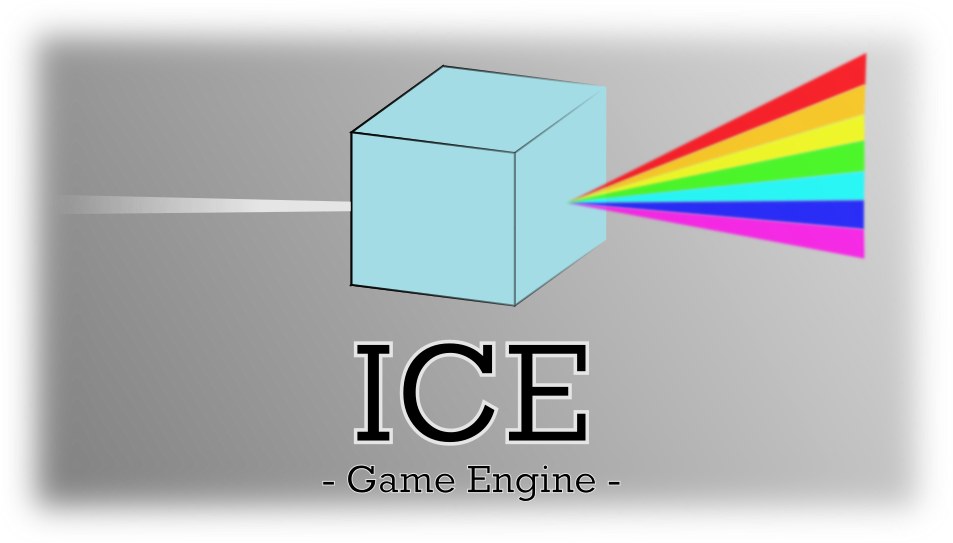

# ICE

ICE is a 3D general purpose game engine written in C++. The aim of the project is to have an engine good enough to create all kind of games in an easy manner, but not to compete with the big names (unity/unreal).

## Getting started

Clone the repo with `git clone https://github.com/ProtectedVariable/ICE`

Create a `build/` directory in `ICE`

## Windows

You can now CMake to configure a VS project (set Source dir: `ICE/`, set build sir: `ICE/build`)
- Press `Configure`
- Press `Generate`
- Press `Open Project`

In visual studio set `ICE` as the startup project and build :)

## OSX

- `cd build`
- `cmake ..`
- `make`

## Linux

Make sure you have `libxrandr-dev libgtk-3-dev` package installed.
- `cd build`
- `cmake ..`
- `make`

## ECS Architecture

The engine is built with an Entity-Component-System architecture. This allow to have a vast array of behaviours on the different objects in the game very easily

## Roadmap

The [trello board](https://trello.com/b/Jstm3EL9/ice) of the project is available. This is a rough estimate of the progress done on the engine.
